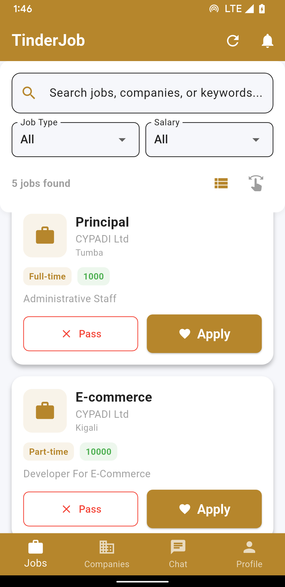
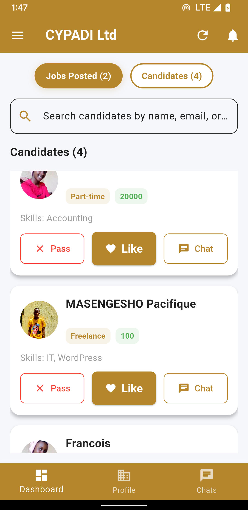

# TinderJob

**Student:** MASENGESHO Pacifique  
**REG NO:** 22RP03084   

---

## App Overview

**TinderJob** is a modern Flutter mobile application that connects job seekers and employers using a familiar, swipe-based interface inspired by Tinder. The app streamlines the job search and hiring process, making it fast, engaging, and mobile-first. It features real-time chat, user profiles, employer dashboards, and a subscription-based monetization model.

---

## Problem Statement & Market Fit

**Problem:**
Traditional job-hunting platforms are **complex, slow, and not user-friendly**, especially for young job seekers. These platforms are filled with outdated listings, long forms, and limited interaction options. On the employer side, recruiters find it hard to **quickly scan through candidates** and connect in real time. This leads to **frustrating delays** and **missed opportunities** in hiring.

**Target Audience:**

- **Young professionals** and recent graduates looking for jobs or internships
- **University students** seeking part-time roles or remote internships
- **Startups and small to medium enterprises (SMEs)** with limited HR resources
- **Recruiters** who prefer fast, mobile, and simplified hiring solutions
---

## 📊 Market Research & Unique Selling Proposition (USP)

### 🛠️ Existing Solutions:
- **LinkedIn**: Focused on networking but lacks swipe-based, fast interactions.
- **Indeed** and **Glassdoor**: Traditional job boards with text-heavy UX and slow communication.
- **JobSwipe**: Similar concept but lacks advanced chat, employer dashboards, and local targeting.

### 💎 TinderJob’s USP & Competitive Advantage:
- **Swipe-to-Match**: Gamified, Tinder-style experience tailored to hiring.
- **Direct Messaging**: Real-time chat between matched users.
- **Employer Dashboard**: Manage candidates and posts from one place.
- **Subscription Model**: Monetization without relying on ads.
- **Cross-Platform**: Built in Flutter for Android, iOS, and Web.

---

## 🧠 Solution Justification

**TinderJob** streamlines the job search and hiring process through:
- A **modern, intuitive UI** for both job seekers and employers.
- **Swipe mechanics** to simplify selection and reduce time-to-connect.
- **Real-time Firestore-based chat** for instant engagement after a match.
- A **freemium subscription model** that fits students and startups alike.
- **Push notifications**, profile personalization, and gamified features to increase engagement and retention.
---

## Key Features

### For Job Seekers
- Swipe through job listings and apply instantly
- Create/edit professional profiles (photo, name, skills, job type, salary expectation)
- View and manage subscription status
- Chat with employers after matching

### For Employers
- Post and manage jobs
- Swipe through candidate profiles
- Chat with matched candidates
- Employer dashboard for job/candidate management

### Core
- Google Sign-In, Firebase Auth
- Real-time Firestore database
- Push notifications (Firebase Messaging)
- Modern Material 3 UI
- Cross-platform (Android, iOS, Web)

---

## Monetization Plan

- **Freemium Model:**
  - Free users: Limited messaging (3 messages/day)
  - Paid subscription: Unlimited messaging, premium placement
- **Subscription Tiers:** Weekly, Monthly, Annual (see in-app plans)
- **Payment Integration:**
  - Simulated mobile payment gateway (see `lib/payment/hdev_payment.dart`)
  - UI for payment, error handling, and subscription status
- **Future Revenue Streams:**
  - Employer premium listings
  - In-app advertising
  - Profile boosting for job seekers
---

## Analytics & Tracking

- **Firebase Analytics** integrated
- **Tracked Events:**
  - User signups/logins
  - Swipes (left/right)
  - Matches
  - Subscription purchases
  - Feature usage (profile updates, job posts, chat)
- **Purpose:**
  - Understand user behavior, improve retention, optimize monetization
  - Data is anonymized and used only for product improvement

---

## Sustainability Plan

- **Continuous Updates:**
  - Regular feature releases and bug fixes
  - Plan for automated CI/CD pipeline
- **User Retention:**
  - Push notifications for matches, messages, new jobs
  - Onboarding for new users
  - Planned gamification (badges, streaks)
- **Customer Acquisition Cost (CAC) Strategies:**
  - Social media marketing
  - Referral incentives (invite friends, get premium)
  - App store optimization (ASO)
- **Feedback Loops:**
  - In-app feedback and support
  - Analytics-driven improvements

---

## Security & Reliability

- **Authentication:** Secure Firebase Auth (Google Sign-In, email/password)
- **Data Protection:**
  - Firestore security rules restrict access to user data
  - No sensitive data stored on device
- **API Handling:**
  - API keys/secrets secured
  - HTTPS enforced for all network traffic
- **Compliance:**
  - GDPR-ready (user data can be deleted on request)
  - No third-party data sharing
- **Reliability:**
  - Manual and widget tests for major flows
  - Responsive design for various devices
  - In-app error messages and fallback UI

---

## Scalability & Performance

- **Code Structure:** Modular, with separation of concerns (screens, services, utils)
- **Performance:**
  - Efficient Firestore queries
  - Lazy loading of data and images
  - Optimized for low-bandwidth environments
- **Cross-Platform:** Works on Android, iOS, and Web

---

## Installation & Running the App

1. **Clone the repository:**
   ```bash
   https://github.com/pabon25/mobileAppdevExam2025.git
   cd 22RP03084
   ```
2. **Install dependencies:**
   ```bash
   flutter pub get
   ```
3. **Firebase setup:**
   - Create a Firebase project
   - Add your config to `lib/firebase_options.dart`
   - Enable Auth, Firestore, Messaging
4. **Run the app:**
   ```bash
   flutter run
   ```
5. ## Release Build: Generate Keystore & Build APK/AAB

To publish your app on the Play Store, follow these steps:

1. **Generate a Keystore:**
   Open PowerShell and run:
   ```powershell
   keytool -genkey -v -keystore my-release-key.jks -keyalg RSA -keysize 2048 -validity 10000 -alias tinderjob
   ```
   - Save `my-release-key.jks` in the project root or `android/` folder.

2. **Configure Keystore in Flutter:**
   - Create a file `android/key.properties` with:
     ```properties
   storeFile=d:/tinderjob/my-release-key.jks
   storePassword=2345678
   keyPassword=2345678
   keyAlias=my-key-alias

     ```
   - Reference this file in `android/app/build.gradle.kts`.

3. **Update Gradle Config:**
   - Ensure signing configs are set in `build.gradle.kts` for release builds.

4. **Build APK & AAB:**
   Run these commands in PowerShell:
   ```powershell
   flutter build apk --release
   flutter build appbundle
   ```
   - Find your APK/AAB in `build/app/outputs/`.
6. **Submission on Email:**
   - Compress the generated `.apk` and `.aab` files into a `.zip` archive
     ### https://drive.google.com/file/d/1iHJKvitUmxJacBV_vnmiiuoKiWDI4Wwk/view
---

## Project Structure

```
lib/
├── main.dart
├── login_screen.dart
├── register_screen.dart
├── swipe_screen.dart
├── employer_dashboard.dart
├── firebase_options.dart
├── payment/
│   └── hdev_payment.dart
├── screens/
├── utils/
└── widgets/
```

---

## Screenshots




## License

MIT License
